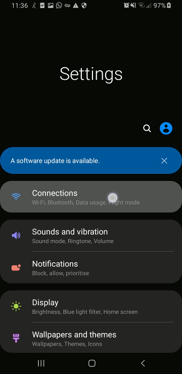

# How to 

Are you suffering from an unreliable home internet connection? 

Do you have a data allowance on your phone?

Then here's a way to use your phone (and its data package) to smooth over temporary connectivity issues in your home WiFi.

You will need:-

* And Android phone, with
* a data allowance you don't mind using, and
* (optional) a USB cable to connect your phone to your computer (micro-USB or USB-C, depending on your phone)

This guide should work for any Android phone.

This guide should work for any Android phone.

Your phone screens will probably look different to mine,
but the options will have identical names (or at least very similar) .

## Step 1: Enable Developer Options

This just allows us to access advanced config options your phone already has built-in.

It doesn't damage your phone in any way, and is reversible.

**This is not the same as rooting your phone, and will not void your warranty! don't worry.**

There are plenty of other guides on the internet on how to do this, but here's mine.

1. Open Your Settings app, and scroll down to the bottom 
2. Select "About Phone": 

----------
3. Select "Software Information": 

----------
4. Keep tapping "Build Number" until you see a message popup saying "You are now a developer!"

  
----------
## Step 2: Keep Data On

In this step, we're going to keep your phone's data connection on, to speed up switching when your Wifi goes down or becomes bad.

The downside is, this will decrease battery life while this is turned on. Turn it off again when you're not using it.

**This won't route all traffic through your monthly data allowance or anything like that.**

Your phone will *still* only use your data when Wifi becomes unavailable.

1. Open Your Settings app again, and scroll to the bottom
2. Select the new "Dveloper Options"

----------
3. Scroll down until you see an option labeled "Mobile Data Always Active", and turn it on.

----------
## Step 3: Connect (Tether) your PC to your phone

In this step, we are going to route your computer's internet connection through your phone,
to take advantage of your data connection as a fallback.

Most of the time, your internet traffic will still go through your home Wifi.

But when this becomes unreliable, 
your phone (and thus your computer) will fall back to using your data connection temporarily.

There are 3 ways of conecting your computer to the internet using your phone (called "tethering"):

* Using a WiFI hotspot
* tethering over bluetooth (not recommended)
* USB tethering (most secure, but requires a USB cable)

I personally recommend going with the USB tether option, as it has the advantages of preventing others from piggybacking on your phone's internet,
AND keeps your phone charged while using it.

*note: these screens vary quite a lot over phones. Just find an option marked "tethering and local hotspot"*

### USB Tethering

1. Open your settings app (one last time
2. Select an option with a name like "Network"/"Connections"/"Connectivity" or similar. Here's it's called "Connections".

----------
3. Select "Mobile Hotspot and Tethering"

----------
4. Connect your phone to your computer using your USB cable
5. Enable the "USB Tethering" option

----------
6. On your computer, disconnect from any other internet connections:
  * disconnect from your local Wifi
  * unplug any ethernet cables

------

## Complete

Your computer should now be using your phone's data connection as a fallback internet connection when your home Wifi goes bad.

Enjoy!